# WTEO — Sistem Mimarisi

> **Wing Tsun & Escrima Organization** — Çok kiracılı dövüş sanatları okulu yönetim sistemi için teknik mimari dokümantasyonu.

---

## İçindekiler

1. [Genel Bakış](#1-genel-bakış)
2. [Backend Mimarisi](#2-backend-mimarisi)
3. [Frontend Mimarisi](#3-frontend-mimarisi)
4. [Veritabanı Modeli](#4-veritabanı-modeli)
5. [Yetkilendirme Akışı](#5-yetkilendirme-akışı)
6. [Öğrenci İlerleme Sistemi](#6-öğrenci-i̇lerleme-sistemi)
7. [Event / Seminer Sistemi](#7-event--seminer-sistemi)
8. [Mail Sistemi](#8-mail-sistemi)

---

## 1. Genel Bakış

WTEO, React tabanlı bir SPA frontend ile FastAPI tabanlı async bir REST backend'den oluşur. İki katman birbirinden bağımsız geliştirilip deploy edilebilir; iletişim yalnızca `/api/*` endpoint'leri üzerinden gerçekleşir.

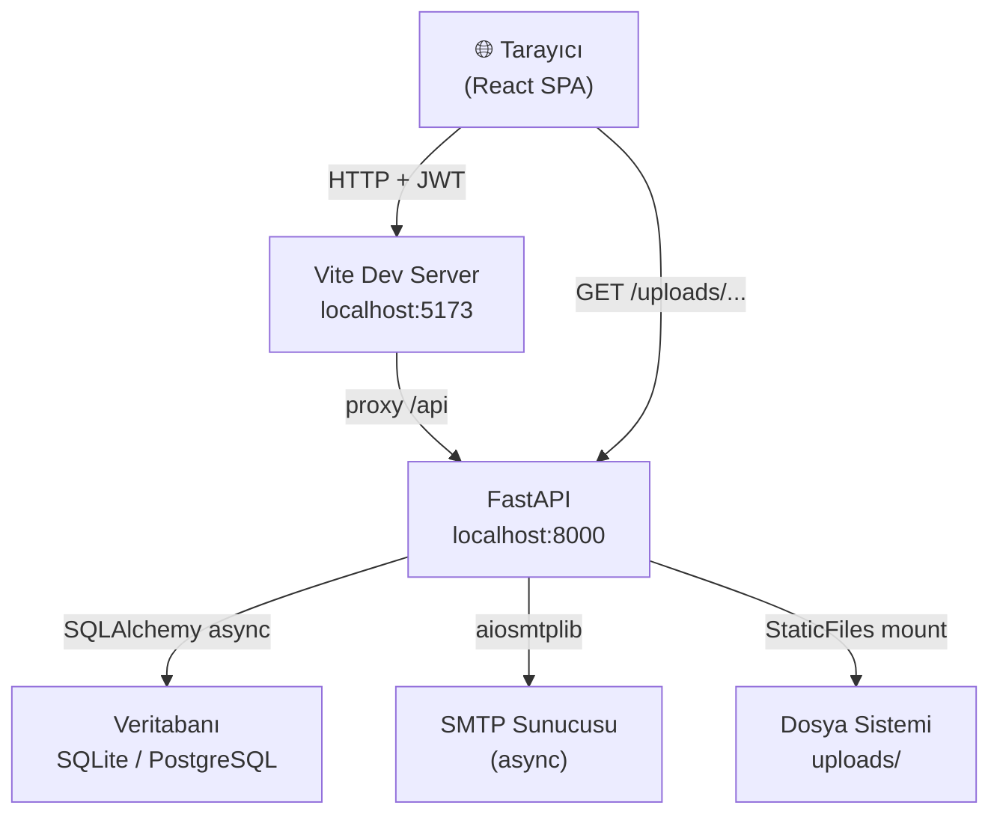

---

## 2. Backend Mimarisi

### 2.1 Katman Yapısı

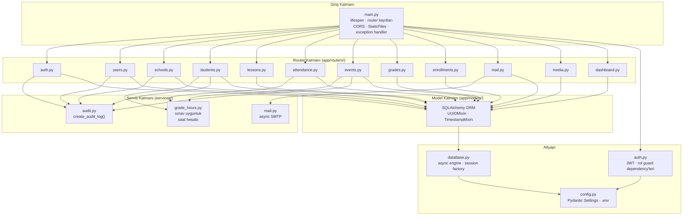

### 2.2 Request Yaşam Döngüsü

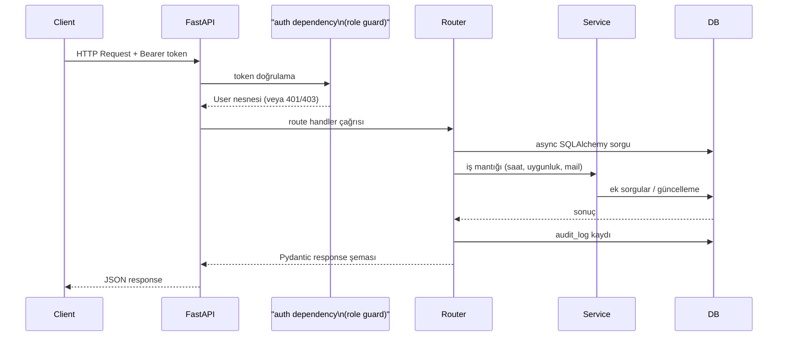

### 2.3 Klasör Yapısı

```
backend/
├── app/
│   ├── main.py              # Uygulama giriş noktası
│   ├── auth.py              # JWT decode, require_role()
│   ├── config.py            # Settings (DATABASE_URL, SECRET_KEY …)
│   ├── database.py          # async_engine, AsyncSessionLocal, get_db()
│   ├── models/
│   │   ├── base.py          # UUIDMixin, TimestampMixin
│   │   ├── user.py          # User, UserRole, UserStatus, InstructorTitle
│   │   ├── school.py        # School, SchoolManager
│   │   ├── student.py       # Student, StudentProgress, Branch
│   │   ├── lesson.py        # Lesson
│   │   ├── lesson_schedule.py
│   │   ├── attendance.py    # Attendance (saat takibi)
│   │   ├── grade.py         # Grade
│   │   ├── event.py         # Event, EventSchool, EventRegistration, SeminarEvaluation
│   │   ├── enrollment.py    # Enrollment
│   │   ├── product.py
│   │   ├── request.py
│   │   ├── media.py
│   │   ├── email_log.py
│   │   └── audit_log.py
│   ├── routers/             # Her model için ayrı router
│   └── schemas/             # Her router için Pydantic şeması
├── services/
│   ├── audit.py
│   ├── mail.py
│   └── grade_hours.py
├── run.py                   # uvicorn başlatıcı
├── seed.py                  # Test verisi
├── create_superuser.py
└── requirements.txt
```

---

## 3. Frontend Mimarisi

### 3.1 Bileşen Hiyerarşisi

```mermaid
graph TD
    main["main.jsx\nReactDOM · BrowserRouter"]
    App["App.jsx\nRoute tanımları\nrol bazlı guard'lar"]
    AuthCtx["AuthContext\nJWT token · kullanıcı state\nlogin / logout / refresh"]
    API["services/api.js\nAxios instance\nrequest interceptor (token)\nresponse interceptor (401 → refresh)"]

    subgraph "Layout"
        Layout["Layout.jsx\nNavbar · Sidebar · Outlet"]
    end

    subgraph "Sayfalar"
        P1[Dashboard]
        P2[Schools]
        P3[Students]
        P4[Lessons]
        P5[Events]
        P6[Grades]
        P7[Products]
        P8[Requests]
        P9[Mail]
        P10[Media]
        P11[Users]
        P12[Profile]
        P13[MySchool]
        P14[PendingStudents]
        P15[Register]
    end

    subgraph "Ortak Bileşenler"
        C1[ProtectedRoute]
        C2[PageHeader]
        C3[Modal]
        C4[Toast]
    end

    main --> App
    App --> AuthCtx
    App --> C1 --> Layout
    Layout --> P1 & P2 & P3 & P4 & P5 & P6 & P7 & P8 & P9 & P10 & P11 & P12 & P13 & P14 & P15
    P1 & P2 & P3 & P4 & P5 --> API
    API --> AuthCtx
```

### 3.2 Token Yenileme Akışı (Axios Interceptor)

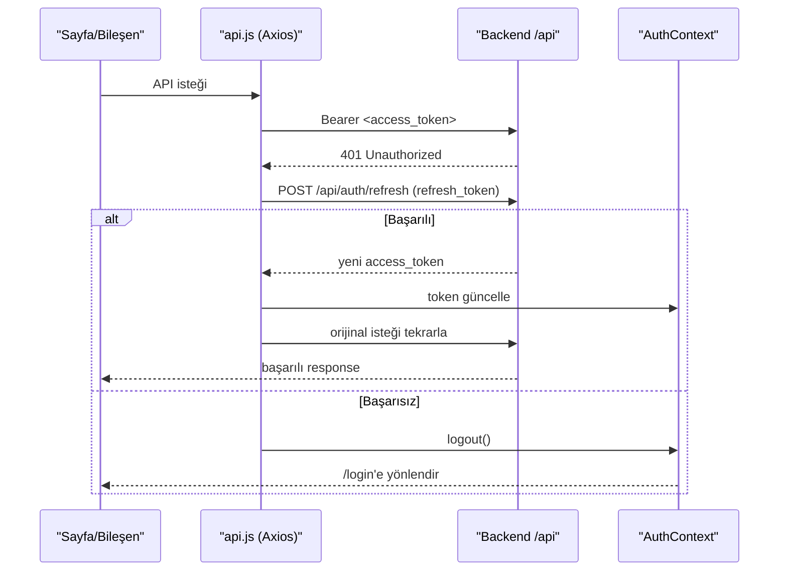

### 3.3 Routing & Rol Koruması

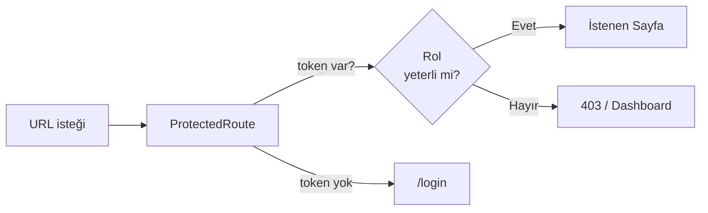

---

## 4. Veritabanı Modeli

### 4.1 Temel İlişkiler

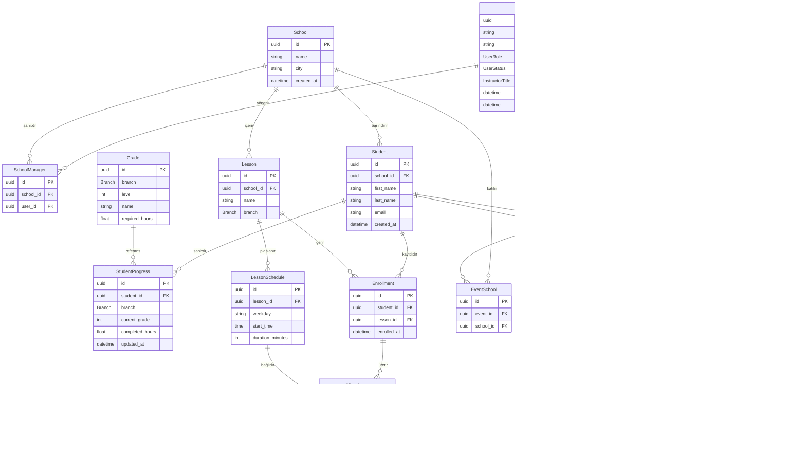

### 4.2 Temel Mixin'ler

Tüm modeller `base.py`'deki iki mixin'i miras alır:

- **UUIDMixin** — `id` alanı UUID v6 olarak otomatik üretilir
- **TimestampMixin** — `created_at` ve `updated_at` otomatik yönetilir

### 4.3 Enum Tipleri

| Enum | Değerler |
|------|----------|
| `UserRole` | SUPER_ADMIN, ADMIN, MANAGER, USER, MEMBER |
| `UserStatus` | ACTIVE, INACTIVE, PENDING |
| `InstructorTitle` | SI, SI-WTL, WTL, … |
| `Branch` | WING_TSUN, ESCRIMA |

---

## 5. Yetkilendirme Akışı

### 5.1 Rol Hiyerarşisi

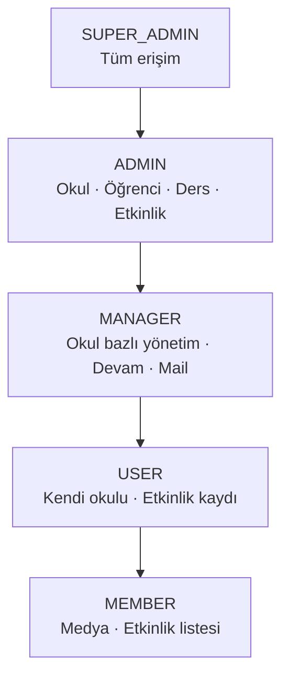

### 5.2 Login & Token Akışı

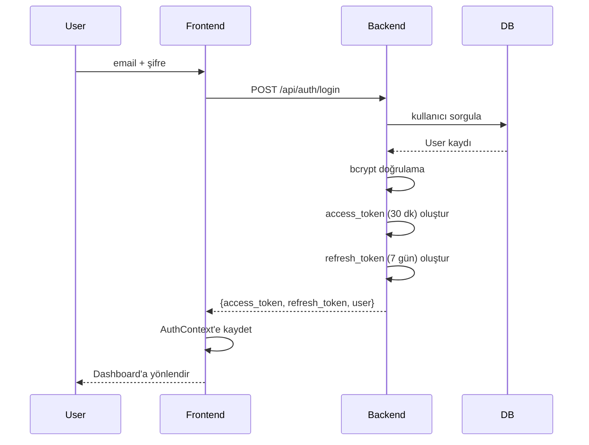

### 5.3 Endpoint Koruma Mekanizması

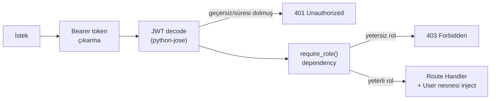

> **Not:** Refresh token şu an veritabanında saklanmamaktadır. Bu durum logout sonrası token iptalini imkânsız kılar. Üretim ortamı için token revocation listesi (Redis veya DB tablosu) önerilir.

---

## 6. Öğrenci İlerleme Sistemi

### 6.1 Veri Modeli

Her öğrenci, kayıtlı olduğu her şube (Wing Tsun / Escrima) için ayrı bir `StudentProgress` kaydına sahiptir. Bu kayıt; mevcut derece (`current_grade`) ve tamamlanan saati (`completed_hours`) tutar.

### 6.2 Saat Güncelleme Akışı

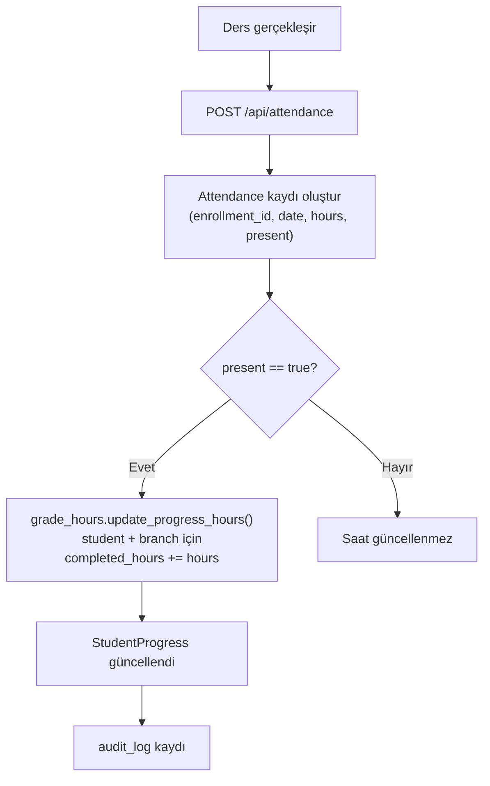

### 6.3 Sınav Uygunluk Hesabı

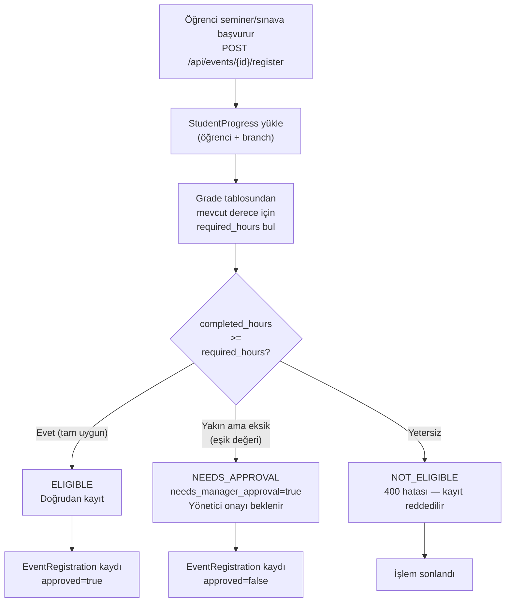

### 6.4 Seminer Sonrası Değerlendirme

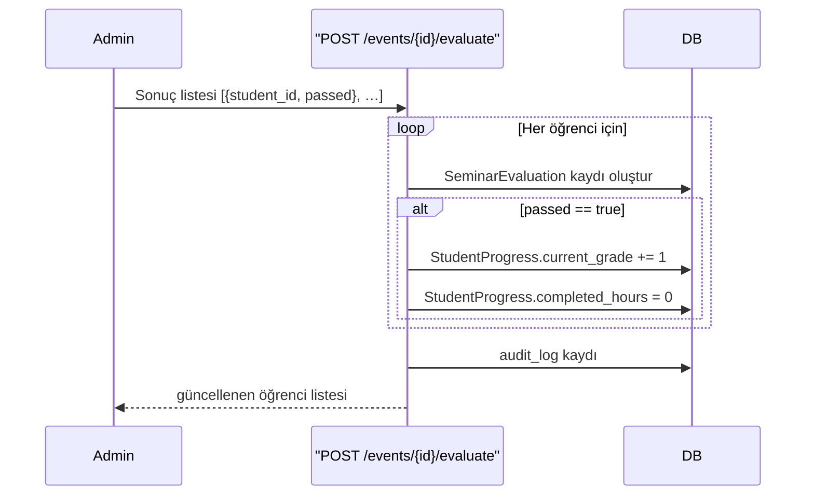

### 6.5 Derece → Saat Eşlemesi (`grade_hours.py`)

`grade_hours.py` servisi, her derece seviyesi için gereken minimum saati tanımlar. Bu eşleme, hem uygunluk hesabında hem de ilerleme görselleştirmesinde kullanılır.

```
Grade 0 (Başlangıç) →  X saat
Grade 1             →  Y saat
Grade 2             →  Z saat
…
```

---

## 7. Event / Seminer Sistemi

### 7.1 Varlık İlişkileri

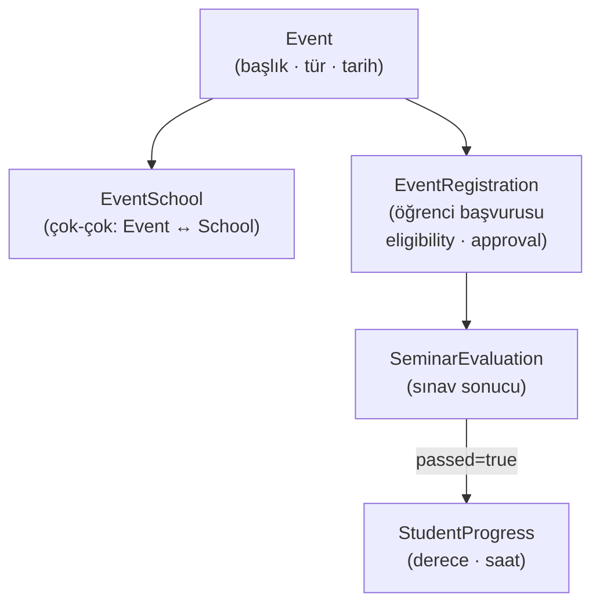

### 7.2 Tam Etkinlik Yaşam Döngüsü

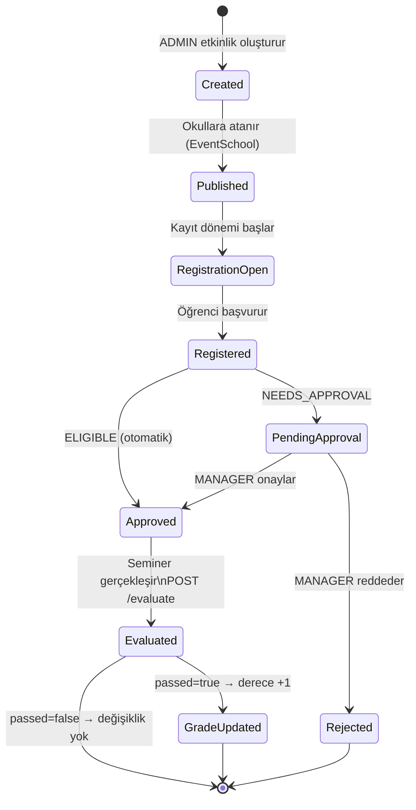

### 7.3 API Endpoint'leri

| Method | Endpoint | Açıklama |
|--------|----------|----------|
| GET | `/api/events` | Etkinlik listesi |
| POST | `/api/events` | Etkinlik oluştur |
| GET | `/api/events/{id}` | Etkinlik detayı |
| POST | `/api/events/{id}/schools` | Okul ata |
| POST | `/api/events/{id}/register` | Öğrenci başvurusu + uygunluk kontrolü |
| PATCH | `/api/events/{id}/registrations/{reg_id}` | Onay / red |
| POST | `/api/events/{id}/evaluate` | Seminer değerlendirmesi |

---

## 8. Mail Sistemi

### 8.1 Mimari

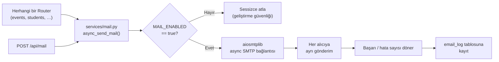

### 8.2 Gönderim Akışı

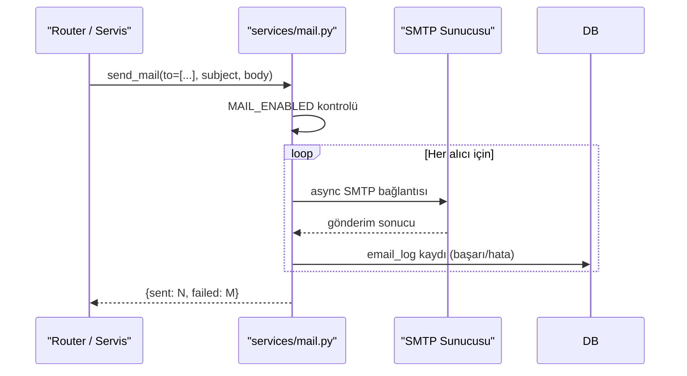

### 8.3 Konfigürasyon

| `.env` Değişkeni | Açıklama |
|------------------|----------|
| `MAIL_ENABLED` | `false` → geliştirmede mail gönderimini devre dışı bırakır |
| `MAIL_HOST` | SMTP sunucusu adresi |
| `MAIL_PORT` | SMTP port (örn. 587) |
| `MAIL_USERNAME` | SMTP kullanıcı adı |
| `MAIL_PASSWORD` | SMTP şifresi |
| `MAIL_FROM` | Gönderen e-posta adresi |

---

## Ekler

### A. Kritik Riskler & Öneriler

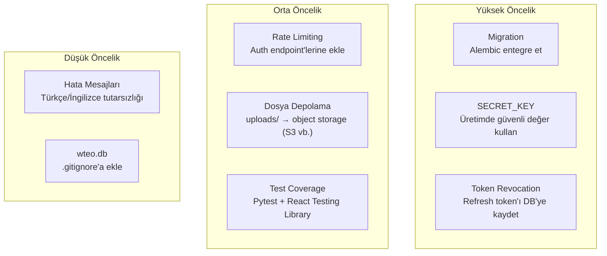

### B. Geliştirme → Üretim Farkları

| Özellik | Geliştirme | Üretim |
|---------|------------|--------|
| Veritabanı | SQLite (aiosqlite) | PostgreSQL (asyncpg) |
| Migration | `create_all` + inline | Alembic |
| Mail | `MAIL_ENABLED=false` | `MAIL_ENABLED=true` + SMTP |
| Dosya depolama | Local `uploads/` | Object storage (S3 vb.) |
| CORS | `localhost:5173` | Gerçek domain |
| Workers | 1 (uvicorn dev) | N (gunicorn + uvicorn workers) |
